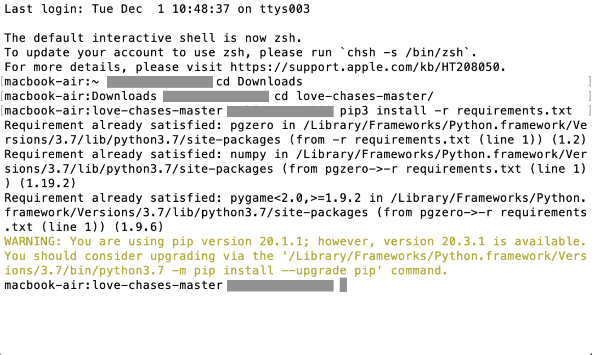
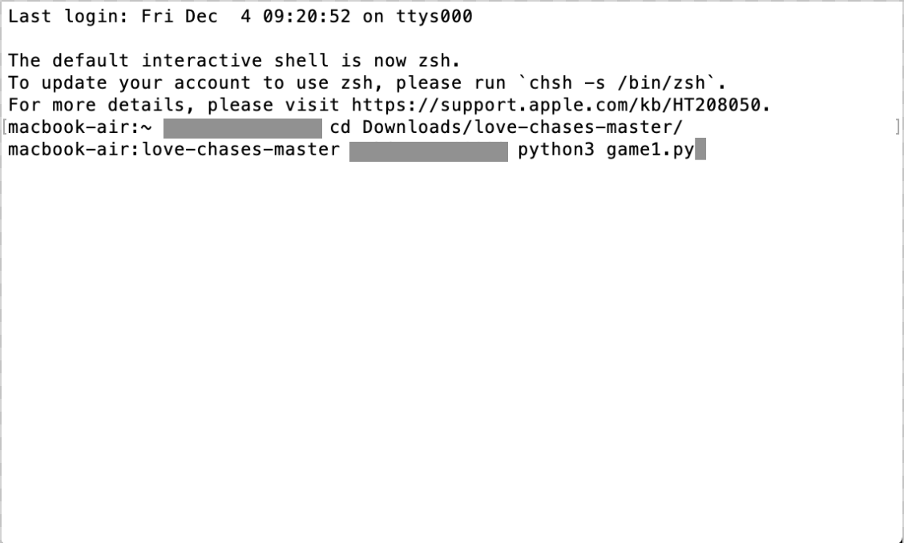

# Love Chase - Level 1 and 2

## Prerequisites
- Install Python 3.7 or Python 3.8 (For Mac/Windows respectively). Download here: https://www.python.org/downloads/ (The specific release version doesn't matter, as long as it starts with 3.7 or 3.8)
- Requires pygame, which is installed automatically

## Download
- Download this file (click the green "Code" and then click "Download ZIP")

## Installation
- Open Command Prompt (Windows) or Terminal (Mac)
- Type `cd Downloads` (or `cd [wherever the ZIP file was saved]`) and press Enter
- Type `cd love-chases-master` and press Enter
- Finally, type `pip install -r requirements.txt`and press enter

## Running the Program
Type either command to run Level 1 or Level 2. The game will start.
- `python game1.py` (Level 1 - Helena chases Demetrius)
- `python game2.py` (Level 2 - Demetrius and Lysander chase Helena)

Move with arrow keys, avoid the chaser! You can only exit the woods if you obtain all fairies. Good luck!

## Reasoning and Rationale
- Read here: https://sites.google.com/uci.edu/unicorn/amsnd-game

## Screenshots
**First Step**

**Second Step**

**Third Step**

**Good to Go!**

